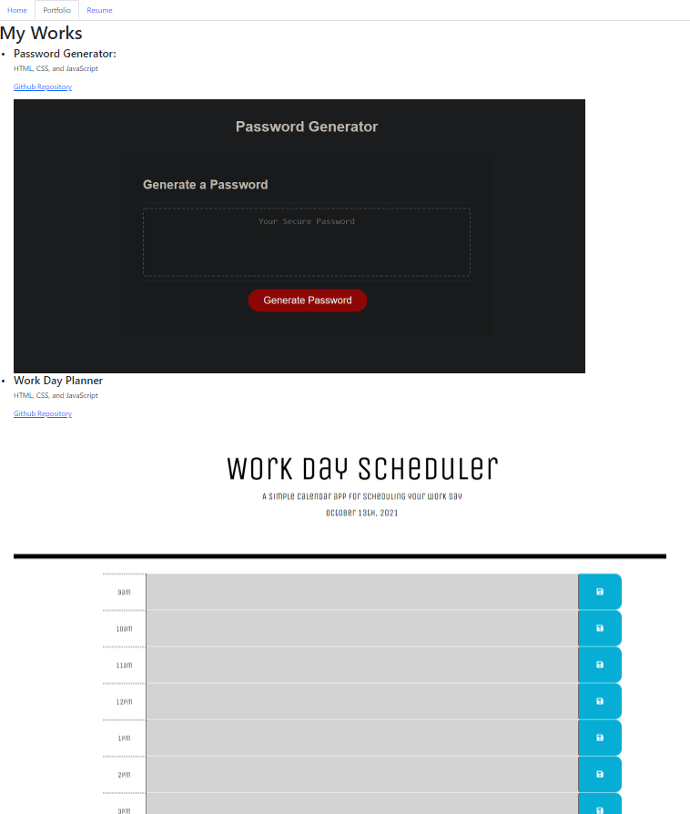

Unfortunately due to time constraints I couldn't get my portfolio working the way I wanted

I will be working at fixing this as soon as I can!

These are the pages I got to render with a navbar that has tabs.

